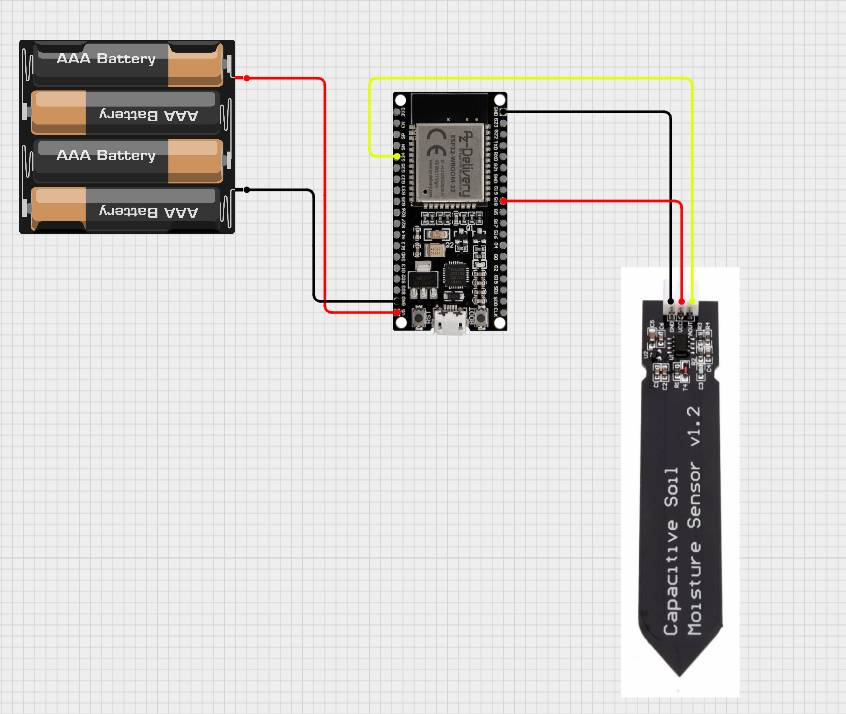

System IoT do monitorowania wilgotności gleby oparty na mikrokontrolerze ESP32, napisany w języku MicroPython. Urządzenie komunikuje się bezprzewodowo z Home Assistant za pomocą protokołu MQTT, umożliwiając zdalny monitoring roślin, wizualizację danych oraz automatyczne powiadomienia.

## 📌 Opis projektu

Celem projektu jest stworzenie prostego i rozbudowywalnego systemu IoT do monitorowania warunków uprawy roślin.

ESP32 odczytuje dane z czujnika wilgotności gleby, przetwarza je i wysyła do brokera MQTT. Home Assistant odbiera dane, prezentuje je na dashboardzie oraz umożliwia tworzenie automatyzacji, np. wysyłanie powiadomień o konieczności podlania rośliny.

## 🏗️ Architektura systemu

```
Czujnik wilgotności gleby
          ↓
        ESP32
          ↓
       WiFi
          ↓
    MQTT Broker
          ↓
 Home Assistant
          ↓
 Aplikacja mobilna / Dashboard
```

## ✨ Funkcje

* Odczyt wilgotności gleby z czujnika analogowego
* Komunikacja bezprzewodowa przez WiFi
* Przesyłanie danych za pomocą protokołu MQTT
* Integracja z Home Assistant
* Wizualizacja aktualnych i historycznych pomiarów
* Możliwość tworzenia automatyzacji i powiadomień
* Modularna struktura kodu MicroPython

## 🛠️ Wykorzystane technologie

### Hardware

* ESP32
* ***Pojemnościowy czujnik wilgotności gleby*** *(wskazane jest użycie czujnika pojemnościowego ze względu na mniejszą korozje nóżek)*
* Opcjonalne dodatkowe czujniki środowiskowe

### Software

* MicroPython
* MQTT
* Home Assistant
* WiFi
* JSON

## 📂 Struktura projektu

```
esp32-soil-monitor/
│
├── main.py              # Główny program urządzenia
├── config.py            # Konfiguracja WiFi i MQTT
├── mqtt_client.py       # Obsługa komunikacji MQTT
├── sensors.py           # Obsługa czujników
├── boot.py              # Konfiguracja startowa ESP32
│
└── README.md
```

## ⚙️ Instalacja i konfiguracja

### 1. Wgranie MicroPython na ESP32

Pobierz odpowiednią wersję firmware MicroPython i wgraj ją na płytkę ESP32.

### 2. Konfiguracja urządzenia

Uzupełnij dane w pliku konfiguracyjnym:

```python
WIFI_SSID = "twoja_siec"
WIFI_PASSWORD = "twoje_haslo"

MQTT_SERVER = "adres_brokera"
MQTT_USER = "login"
MQTT_PASSWORD = "haslo"
```

### 3. Uruchomienie

Po podłączeniu ESP32 do zasilania urządzenie:

1. Łączy się z siecią WiFi
2. Nawiązuje połączenie z brokerem MQTT
3. Odczytuje wartości z czujnika
4. Publikuje dane do Home Assistant

## 📡 Przykładowa wiadomość MQTT

Urządzenie publikuje dane w formacie JSON:

```json
{
    "device": "soil_sensor_01",
    "moisture": 65,
    "timestamp": "2026-07-08T12:00:00"
}
```

## 🏠 Integracja z Home Assistant

Home Assistant wykorzystuje dane MQTT do utworzenia encji przedstawiających:

* poziom wilgotności gleby
* stan urządzenia
* ostatni czas aktualizacji

Możliwe automatyzacje:

* powiadomienie na telefon przy niskiej wilgotności
* historia pomiarów
* wykresy zmian wilgotności
* obsługa wielu czujników

## 🔒 Bezpieczeństwo

Projekt uwzględnia podstawowe zasady bezpieczeństwa:

* dane logowania przechowywane poza głównym kodem
* autoryzacja MQTT
* brak przechowywania poufnych danych w repozytorium

## 🚀 Możliwe rozszerzenia

* tryb niskiego poboru energii (Deep Sleep)
* zasilanie bateryjne
* aktualizacja firmware przez OTA
* dodatkowe czujniki temperatury i światła
* własna płytka PCB
* obsługa wielu urządzeń IoT

## 📸 Zdjęcia projektu
Schemat projektu
[](schemat.pdf)

