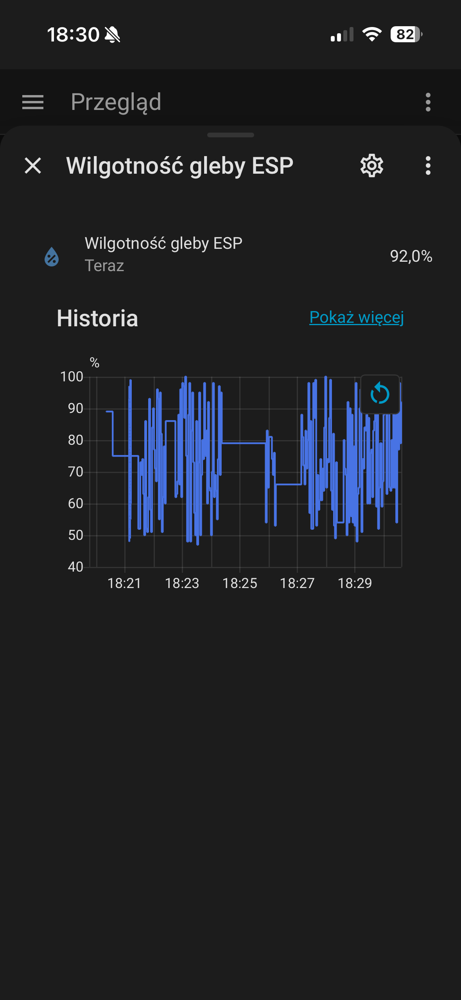

## 📌 Opis projektu

Celem projektu jest stworzenie prostego i rozbudowywalnego systemu IoT do monitorowania warunków uprawy roślin.

ESP32 odczytuje dane z czujnika wilgotności gleby, przetwarza je i wysyła do brokera MQTT. Home Assistant odbiera dane, prezentuje je na dashboardzie oraz umożliwia tworzenie automatyzacji, np. wysyłanie powiadomień o konieczności podlania rośliny.
Projekt skierowany jest zarówno do użytku domowego jak i profesjonalnych rozwiązań plantatorskich.

## 🏗️ Architektura systemu

```
Czujnik wilgotności gleby
          ↓
        ESP32
          ↓
       WiFi
          ↓
    MQTT Broker
          ↓
 Home Assistant
          ↓
 Aplikacja mobilna / Dashboard
```

## ✨ Funkcje

* Odczyt wilgotności gleby z czujnika analogowego
* Komunikacja bezprzewodowa przez WiFi
* Przesyłanie danych za pomocą protokołu MQTT
* Integracja z Home Assistant
* Wizualizacja aktualnych i historycznych pomiarów
* Możliwość tworzenia automatyzacji i powiadomień
* Modularna struktura kodu MicroPython
* Tryb niskiego poboru energii(Deep Sleep)

## 🛠️ Wykorzystane technologie

### Hardware

* [ESP32](https://docs.espressif.com/projects/esp-dev-kits/en/latest/esp32/esp-dev-kits-en-master-esp32.pdf)
* [Pojemnościowy czujnik wilgotności gleby](https://www.datocms-assets.com/28969/1662716326-hw-101-hw-moisture-sensor-v1-0.pdf) *(wskazane jest użycie czujnika pojemnościowego ze względu na mniejszą korozje nóżek)*
* Opcjonalne zasilanie bateriami 4xAAA

### Software

* [MicroPython](https://micropython.org/)
* [MQTT](https://pl.wikipedia.org/wiki/MQTT) *(MQTT Broker Mosquitto)*
* [Home Assistant OS](https://www.home-assistant.io/)
* WiFi 2.4GHz

## 📂 Struktura projektu

```
esp32-soil-monitor/
│
├── main.py              # Główny program urządzenia
├── config.py            # Konfiguracja WiFi i MQTT
├── mqtt_client.py       # Obsługa komunikacji MQTT
├── sensors.py           # Obsługa czujników
└── boot.py              # Konfiguracja startowa ESP32

```

## ⚙️ Instalacja i konfiguracja
*[INSTRUKCJA KROK PO KROKU](instrukcja.txt)*
### 1. Wgranie MicroPython na ESP32

Pobierz odpowiednią wersję firmware MicroPython i wgraj ją na płytkę ESP32.

### 2. Konfiguracja urządzenia

Uzupełnij dane w pliku [config.py](config.py):

```python
WIFI_SSID = "NAZWA SIECI WIFI 2.4GHz"
WIFI_PASSWORD = "HASŁO WIFI"
#################################
MQTT_BROKER = "ADRES IP BROKERA MQTT"
MQTT_PORT = 1883
MQTT_CLIENT_ID = "ID ESP"
MQTT_USER = "NAZWA UŻYTKOWNIKA"
MQTT_PASS = "HASŁO UŻYTKOWNIKA"
#################################
air = WARTOŚĆ W POWIETRZU
water = WARTOŚĆ W WODZIE

```


### 3. Kalibracja czujnika
Przed uruchomieniem systemu należy skalibrować czujnik, aby poprawnie wskazywał 0% i 100%.
1. Wgraj na ESP32 skrypt [kalibracyjny](kalibracja.py)
2. Postępuj zgodnie z instrukcją i wpisz otrzymane wyniki do pliku [config.py](config.py)

### 4. Uruchomienie

Po podłączeniu ESP32 do zasilania urządzenie:

1. Łączy się z siecią WiFi
2. Nawiązuje połączenie z brokerem MQTT
3. Odczytuje wartości z czujnika
4. Publikuje dane do Home Assistant


## 🏠 Integracja z Home Assistant

Home Assistant wykorzystuje dane MQTT do utworzenia encji przedstawiających:

* poziom wilgotności gleby
* stan urządzenia
* ostatni czas aktualizacji

Możliwe automatyzacje:

* powiadomienie na telefon przy niskiej wilgotności
* historia pomiarów
* wykresy zmian wilgotności
* obsługa wielu czujników
* połączenie z systemem automatycznego nawadnania


[](screen_ios.png)

## 🔒 Bezpieczeństwo

Projekt uwzględnia podstawowe zasady bezpieczeństwa:

* dane logowania przechowywane poza głównym kodem
* autoryzacja MQTT

## 🚀 Możliwe rozszerzenia

* zasilanie bateryjne
* dodatkowe czujniki temperatury i światła
* obsługa wielu urządzeń IoT
* automatyczne przypomnienia na telefon, gdy wilgotność ziemi spadnie poniżej progu.
* powiązanie czujnika z systemem automatycznego nawadniania

## 🌿 Scenariusze
```
Wilgotność ziemi pod grujecznikiem japońskim spada poniżej 25%
                               ↓
esp32 odczytuje wartość i przesyła informację do homeassistanta
                                ↓
                        Wysłanie alertu
```

## 📸 Zdjęcia projektu
* Schemat projektu zasilanego przez baterie *(w przypadku zasilania przez usb należy pominąć podłączenie do 5V oraz masy)*
[](miniatura.png)

